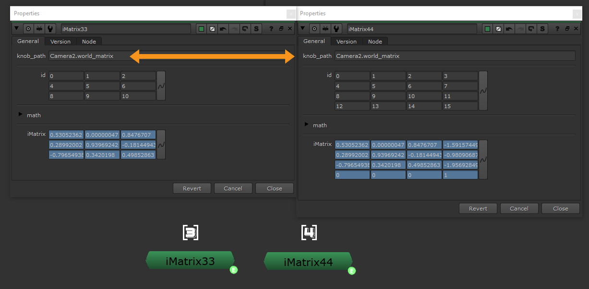

# InverseMatrix33 MJT

**Author:** Mark Joey Tang - [https://www.facebook.com/MJTlab](https://www.facebook.com/MJTlab)

- [https://github.com/xmjtx/MJTLab/tree/main/gizmo_library/Misc/iMatrix_v11](https://github.com/xmjtx/MJTLab/tree/main/gizmo_library/Misc/iMatrix_v11)

iMatrix33, inverse 3x3 matrix which I use the most in deep setup. Live inverse matrix using tcl.
### How to use:
Fill in the "knob_path" and that's it. "id" section can be changed in case the matrix order is different than usual 4x4.
