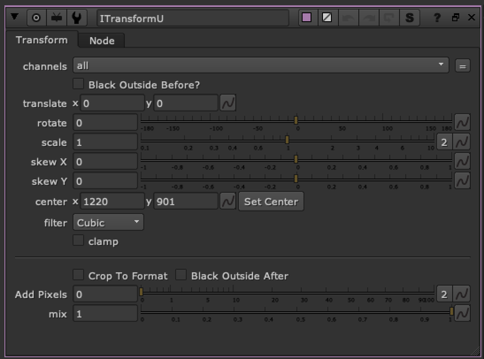

# ITransform FR

**Author:** Frank Rueter - [http://www.ohufx.com](http://www.ohufx.com)

- [http://www.nukepedia.com/gizmos/transform/itransform/](http://www.nukepedia.com/gizmos/transform/itransform/)

Updated version of Frank Rueter's ITransform tool on nukepedia.

Mask based warper with transform controls.
### Updates include:
- **Channels:** defaults to all channels but you can select channel to warp
- **Set Center Button:** Click to set to the center of the root.format or the input.format
- **Black Outside Before/After:** Click to apply a black outside before and/or after the warp, this can eliminate unwanted stretching edge pixels because of bounding box issues.
- **Crop To Format and Add Pixels:** More options for BBox management
- **Mix:** Using a transformMasked node instead of a transform, so the node is able to mix the warp effect
Otherwise the node reacts the same way as the original ITransform node.

