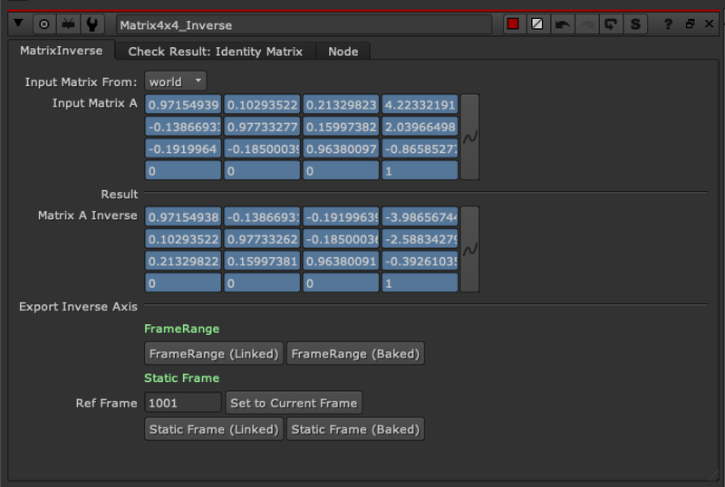

# Matrix4x4_Inverse TL

**Author:** Tony Lyons - [https://www.CompositingMentor.com](https://www.CompositingMentor.com)

Matrix4x4_Inverse is a node that takes a node with a 3d transformation matrix, such as cameras, cards, axis, transformGeo, etc, and produces the inverse matrix. This inverse matrix can be used to return the 3D object to the origin (aka to the identity matrix). Sounds really complicated but an easy way to comprehend it is this node stabilizes and returns the 3d object to the origin, where you can then transform it to a new position. Like a 3D 'Stabilize' and then 'matchmove' technique.

Plug the node into the 3d node or chain of axis' or cameras with transformGeo, etc.

Be sure to choose between the input matrix being either the world matrix or local matrix. Local matrix is only taking into consideration the transformations of that specific input node. World matrix takes into consideration the actual position of the object in 3D space, or the 'totality' of all concatenated 3d transformations (real position).

You can choose to export an Axis node with the inverse matrix either linked or baked and either over a framerange or on a single reference frame.
