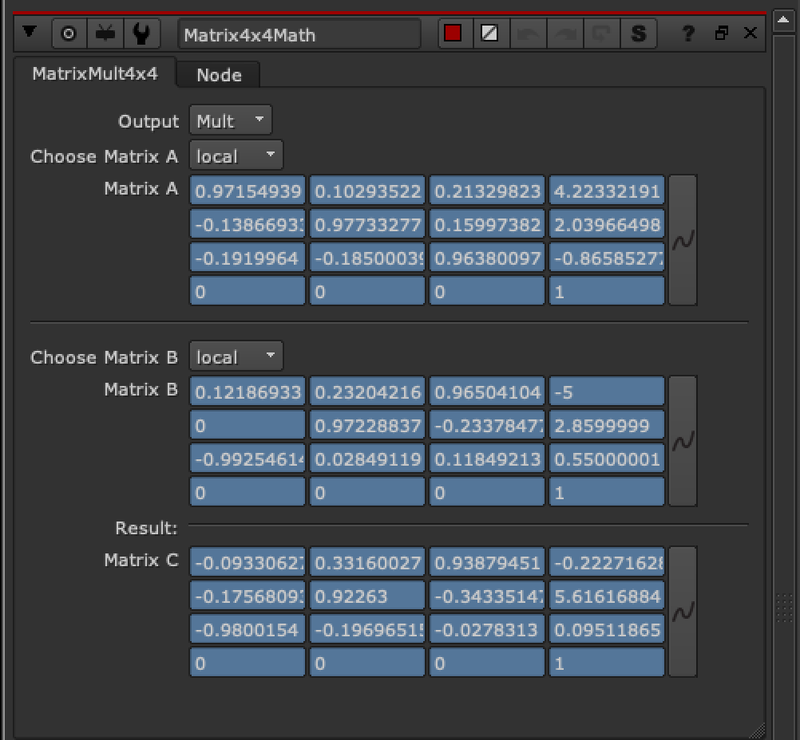
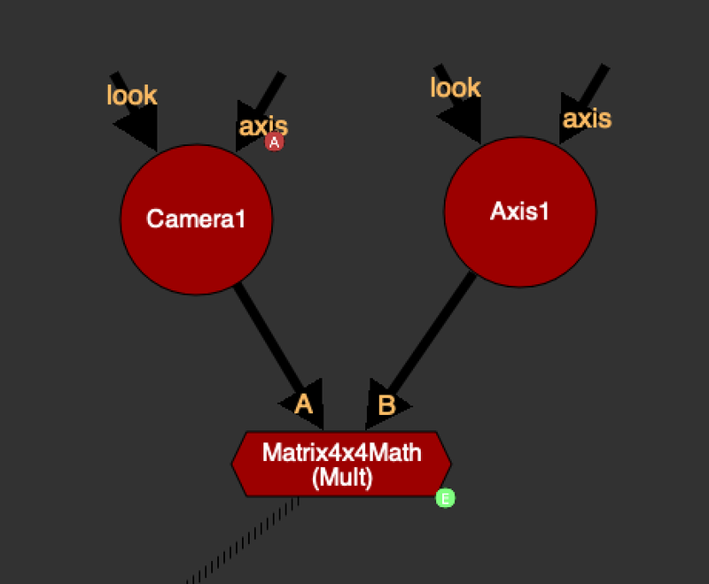

# Matrix4x4_Math TL

**Author:** Tony Lyons - [https://www.CompositingMentor.com](https://www.CompositingMentor.com)

Matrix4x4_Math does some basic matrix math between matrix A and matrix B.
**Operations are:** Add, Subtract, Mult
Choose between local and world matrices of the inputs. You can expression link the resulting matrix (matrix C) to other nodes' local matrix.

