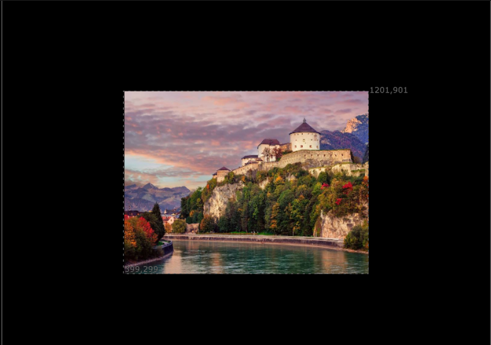
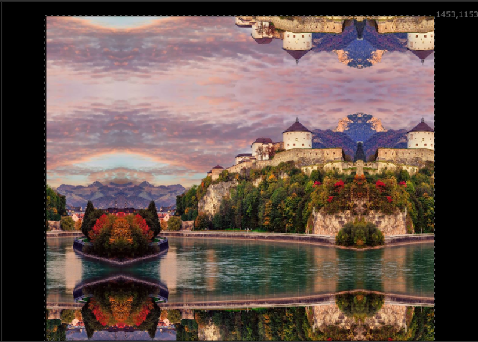

# MirrorBorder TL

**Author:** Tony Lyons - [https://www.CompositingMentor.com](https://www.CompositingMentor.com)

MirrorBorder mimics Adobe AfterEffect's Motion Tile effect. It will tile and mirror the frame around the border of the input format, mostly to be used to produce extra edge pixel details for camera shake. This can avoid either a black edge or stretchy pixels around the edge of frame when adding camera shake.

The tile region is either the input format or input bbox. Tile amount is expansion amount in pixels.

Choke edges refers to cropping the edges in a bit before mirroring them. Left, Right, Top, Bottom choke sliders available.

