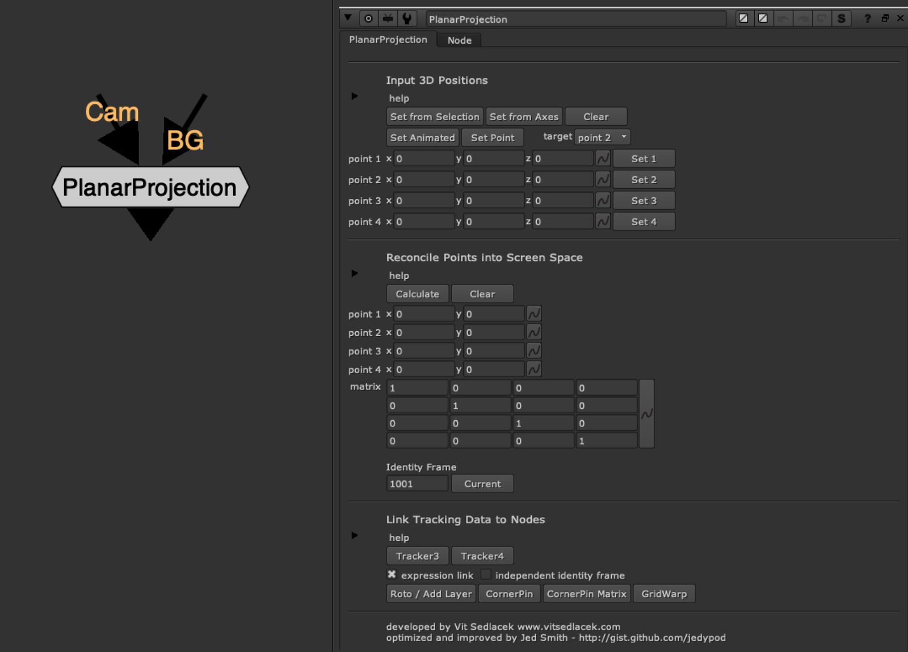

# PlanarProjection NKPD

**Author:** Vit Sedlacek - [http://www.vitsedlacek.com](http://www.vitsedlacek.com)

- [http://www.nukepedia.com/gizmos/3d/vplanarprojection](http://www.nukepedia.com/gizmos/3d/vplanarprojection)
- [https://gist.github.com/jedypod/98dc18acd8008e7e5cbe](https://gist.github.com/jedypod/98dc18acd8008e7e5cbe)

Smart, better and faster Reconcile3D node. PlanarProjection generates 2D coordinates for points in 3D space. Works on 4 points at once, is instantaneous to calculate, and generates a 4x4 transform matrix for use in rotos.

This gizmo was initially developed as a tool for fixing drift in complex matchmove shots in post, rather than spending time to solve unsolvable shots, but during the time it served as a perfect tool for rotoscoping or cornerpinning (instead of using 3d cards).
### Workflow:
1. Connect the camera
2. Select the points in 3d viewport (you can use vertex selection mode, or move handles manually)
3. Generate 2D projection points
4. Generate matrix
5. Use inbuilt functions to generate Rotopaint/SplineWarp or GridWarp node, which is tracked with generated points
