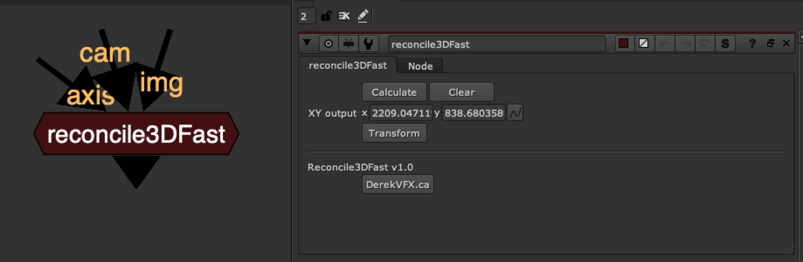

# Reconcile3DFast DR

**Author:** Derek Rein - [https://derekvfx.ca/nuke/](https://derekvfx.ca/nuke/)

- [https://raw.githubusercontent.com/DerekRein/DerekVFX/master/ToolSets/reconcile3DFast.nk](https://raw.githubusercontent.com/DerekRein/DerekVFX/master/ToolSets/reconcile3DFast.nk)

This gizmo is taking some of the python script from PlanarProjection NKPD node by Vit Sedlacek (optimized and improved by Jed Smith).

The planar projection tool is amazing and robust, but this one is simplified for just 1 axis, 2d point result and it is easy, fast, and simple.
