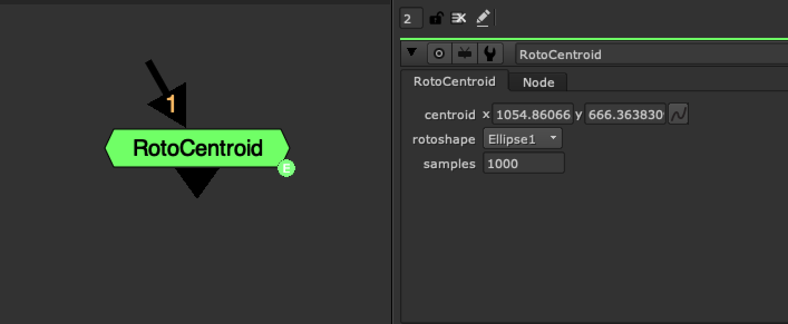

# RotoCentroid NKPD

**Author:** Alister Chowdhury - [http://alisterchowdhury.co.uk/?page=vfx](http://alisterchowdhury.co.uk/?page=vfx)

- [http://www.nukepedia.com/gizmos/transform/roto-centroid](http://www.nukepedia.com/gizmos/transform/roto-centroid)

It tries to find out the centroid of a given rotoshape (based upon the area, NOT bounding box or average point values).

It does this using an algorithm I put together in python for finding the centroid of 2d shapes based upon their point locations.

This allows you to effectively find the center of mass of a Beziers etc.

This differs from the center of the bounding box, or average point values in that it changes depending on how the shape is distributed, so it is unbiased on the amount of points you're using.

I made this because Houdini can do this, so I felt Nuke should be able to as well.

