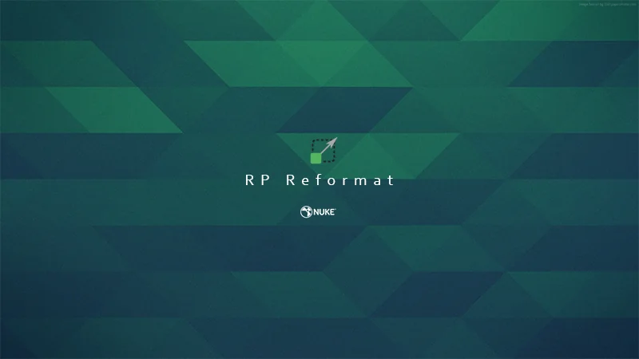
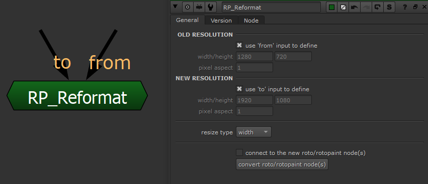

# RP_Reformat MJT

**Author:** Mark Joey Tang - [https://www.facebook.com/MJTlab](https://www.facebook.com/MJTlab)

- [http://www.nukepedia.com/gizmos/draw/rp-reformat](http://www.nukepedia.com/gizmos/draw/rp-reformat)
- [https://m.facebook.com/MJTlab/posts/628051737776651](https://m.facebook.com/MJTlab/posts/628051737776651)
- [http://bit.ly/menupy](http://bit.ly/menupy)

Reformat Roto & RotoPaint node's vector data without resolution issue. Keep the same result on any paint strokes. Support all kinds of splines, brushes and aspect ratio reformat.
### How to use:
1. Fill in the old resolution of the Roto/RotoPaint was done before.
2. Fill in the new resolution.
3. Select which type of resize to process (This depends on how the plate was resized)
4. Select all the Roto/RotoPaint node(s) *Supports multi-select*
5. Click 'convert roto/rotopaint node(s)'. Then the new generated node will be placed next to the original node(s)
**Notes:**
- Entire process will NOT modify the original node
- The resize data will be replaced on individual shape elements:
 - **Spline:** translate, scale, center & feather
 - **Stroke:** translate, scale, center, source translate, brush size, brush space & effect
- Resize process will not touch any data on Layer.

