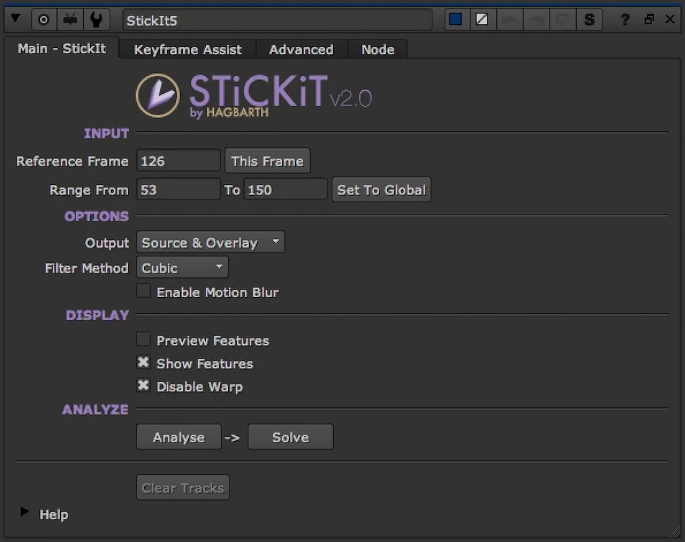

# STiCKiT MHD

**Author:** Mads Hagbarth Damsbo - [https://hagbarth.net/blog/](https://hagbarth.net/blog/)

- [https://hagbarth.net/stickit-digital-makeup-gizmo-for-nuke/](https://hagbarth.net/stickit-digital-makeup-gizmo-for-nuke/)
- [http://www.nukepedia.com/toolsets/transform/stickit-alpha](http://www.nukepedia.com/toolsets/transform/stickit-alpha)

StickIt V2 is a 2D Warp Match-Moving tool, for matchmoving on (from a 2D perspective) non-rigid surfaces.

