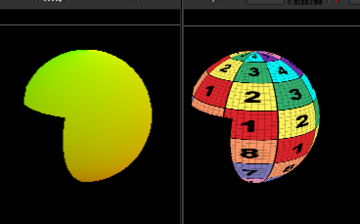
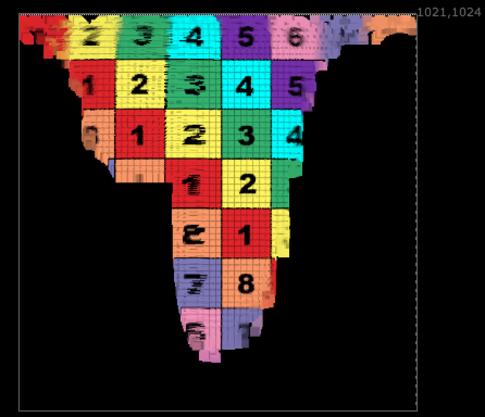
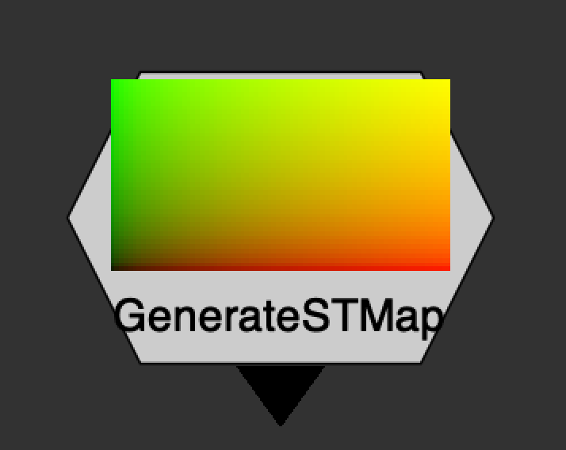

# STMapInverse NKPD

**Author:** Luca Mignardi - [http://www.lookinvfx.com](http://www.lookinvfx.com)

- [http://www.nukepedia.com/gizmos/transform/in_inversestmap](http://www.nukepedia.com/gizmos/transform/in_inversestmap)

A simple and fast solution to Unwarp to UV space your CG render.

The Gizmo uses a simple PositionToPoint node to redistribute each pixel in its UV space position.

Works as the nuke default STMap but does exactly the opposite. Can be used in many different ways.

Very useful especially for reference to know where to draw a roto in UV space to be then distorted via STMap to mask a particular area of your CG render.

