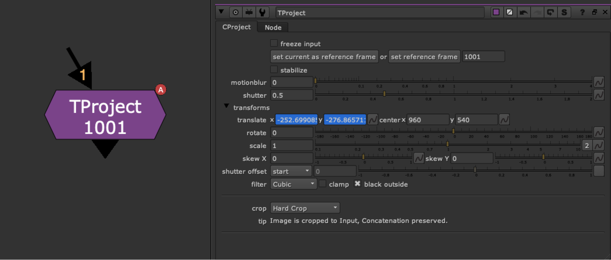
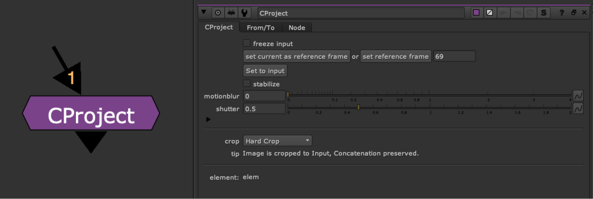
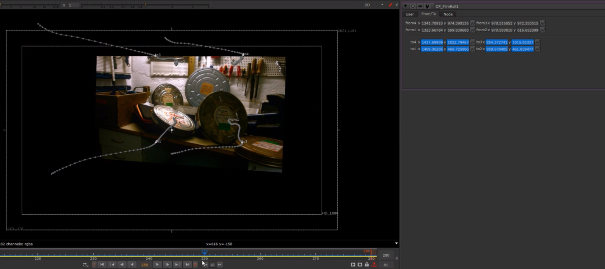

# TProject AK

**Author:** Alexey Kuchinski

- [http://www.nukepedia.com/python/3d/cardtotrack](http://www.nukepedia.com/python/3d/cardtotrack)

TProject is similar to CProject but uses a Transform instead of a CornerPin to do a basic single point track.

Allows you to set frame, switch between stabilize and matchmove, add motion blur, and 3 different BBox management settings:
- **Hard Crop** - (reformat node - concatenation is preserved)
- **Adjustable crop** - breaks concatenation but allows for adjustable bbox
- **No Crop** - no crop applied at all, concatenation preserved but bbox can get quite big
**Set to input:** This will distort the image with the corner pin to fit the format, it is the same as projecting the image on a card and rendering in UV space.

