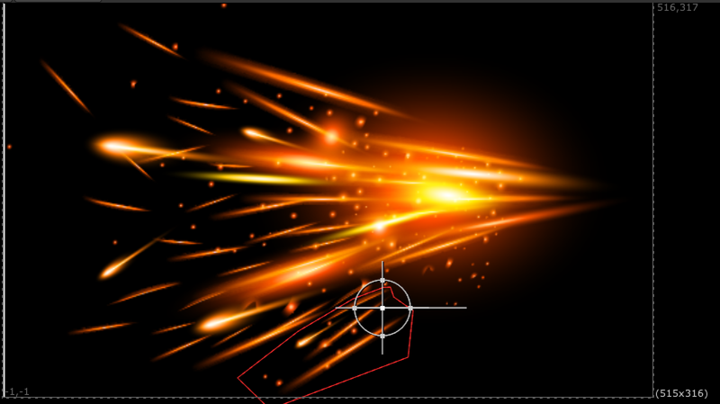
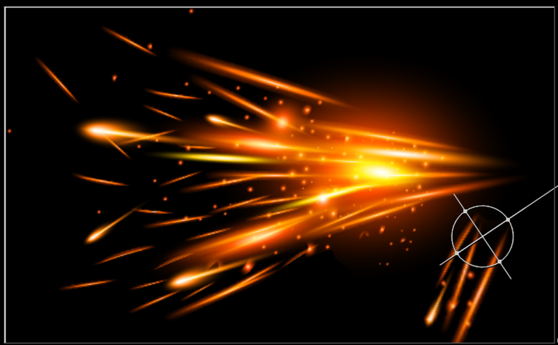

# TransformCutOut TL

**Author:** Tony Lyons - [https://www.CompositingMentor.com](https://www.CompositingMentor.com)

TransformCutOut takes the masked area of the image and transforms it and overs it (disjoint-over) back onto the image. Useful for masking an object and placing it somewhere else.

This is different to the transformMasked node which essentially moves the image around 'inside' of the masked area. This node will cut out the masked area, and over it back after the transformation, leaving a hole where the original mask was.

Buttons to set center pivot to either the center of the input format or the center of the mask bounding box, which is meant to compliment rotoshapes that have their own BBox that you will likely use as the mask input. So this option will snap the center pivot to the center of the rotoshape/mask input.

