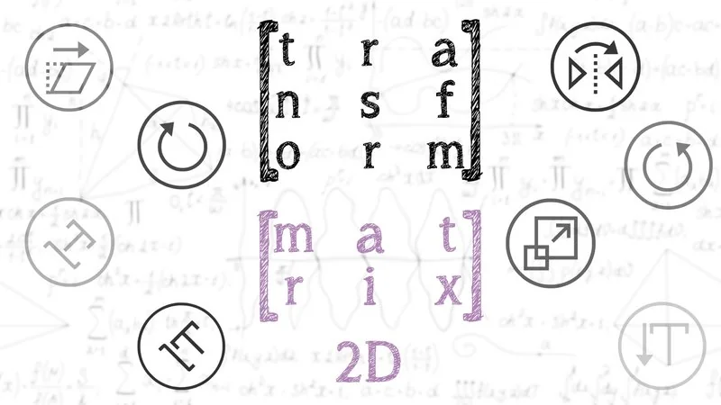
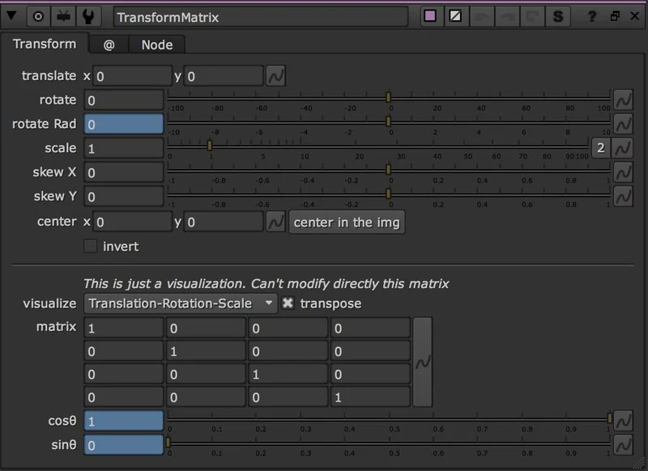
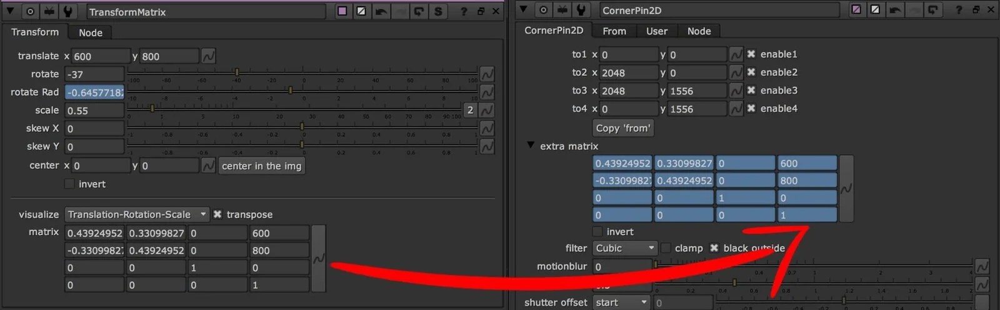

# TransformMatrix AG

**Author:** Andrea Geremia - [http://www.andreageremia.it/tutorial.html](http://www.andreageremia.it/tutorial.html)

- [http://www.nukepedia.com/gizmos/transform/transform-matrix](http://www.nukepedia.com/gizmos/transform/transform-matrix)
- [http://www.andreageremia.it/tutorial_matrix_transform.html](http://www.andreageremia.it/tutorial_matrix_transform.html)

Classic Transform node with a Matrix 4x4.

Modified the Transform node of Nuke, adding a Matrix 4x4.

Now you can visualize the 2D Transformation with a Matrix.

This Matrix is good because you can understand how it works, but at the same time copy/paste the matrix to the extra_matrix knob in the CornerPin (for example).

