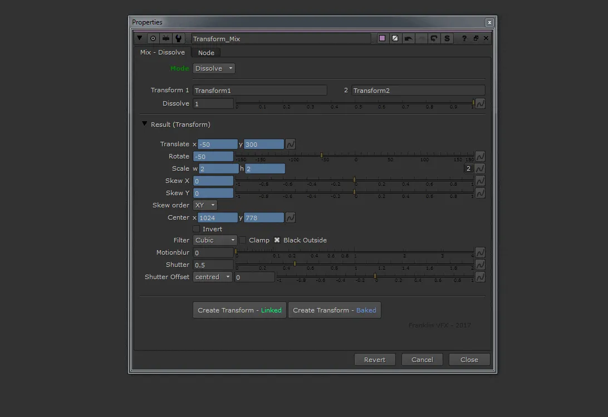
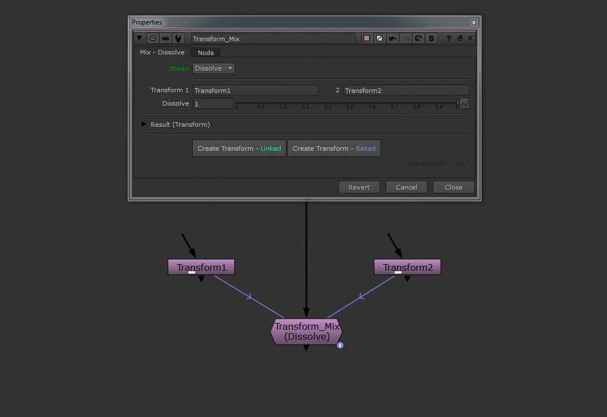
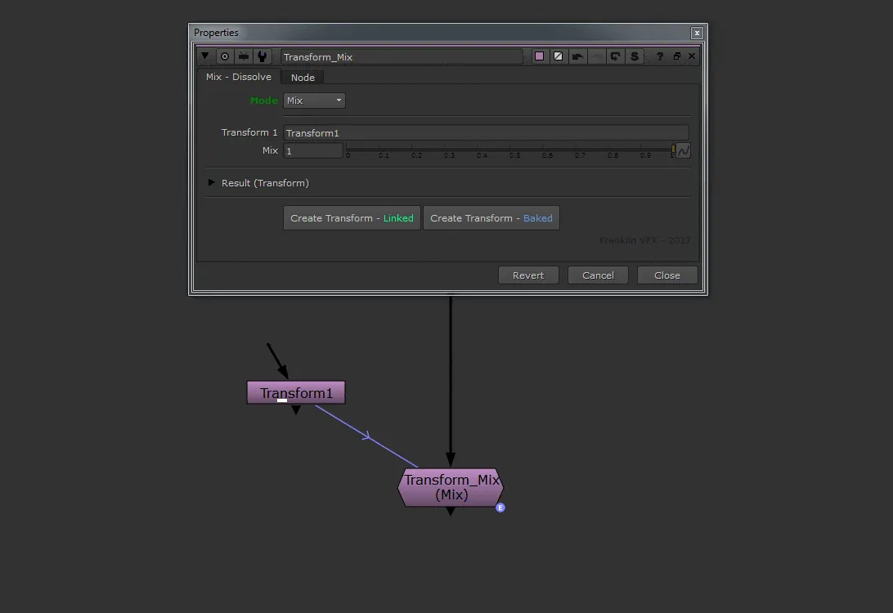

# Transform_Mix NKPD

**Author:** Franklin Toussaint - [http://franklinvfx.com/transform_mix-3/](http://franklinvfx.com/transform_mix-3/)

This tool has two functions:
- **Mix mode** – To decrease the resulting value of another Transform node.
- **Dissolve mode** – To mix two Transform nodes together with a slider.
### Controls:
- **Mode:** To choose between "Mix" mode or "Dissolve" mode
- **Transform 1:** To create a link (enter the name of the Transform reference node)
- **Transform 2:** If on "Dissolve" mode enter the name of the second Transform reference node
- **Mix:** 
 - 0 = all the knobs go to the default value of a native Transform node
 - 1 = the value of all the knobs becomes the value of the linked node (Transform 1)
- **Dissolve:**
 - 0 = the value of all the knobs becomes the value of the linked node (Transform 1)
 - 1 = the value of all the knobs becomes the value of the linked node (Transform 2)
- **Create Transform:** To create a new Transform node with the current transform value (linked or baked)

