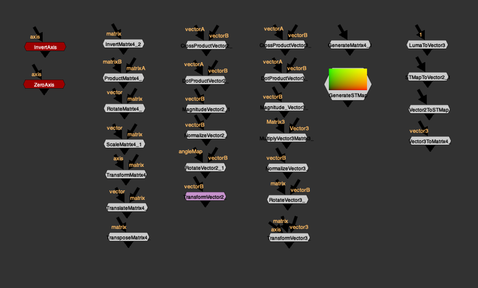
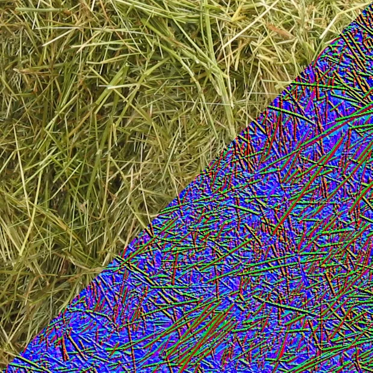

# Vector Math Tools MGA-EL

**Website:** [http://erwanleroy.com/blog/](http://erwanleroy.com/blog/)

- [http://www.nukepedia.com/toolsets/transform/vector-matrix-toolset](http://www.nukepedia.com/toolsets/transform/vector-matrix-toolset)
- [http://www.nukepedia.com/toolsets/other/vectortools](http://www.nukepedia.com/toolsets/other/vectortools)
- [https://github.com/mapoga/nuke-vector-matrix](https://github.com/mapoga/nuke-vector-matrix)
- [http://erwanleroy.com/vector-tools-for-nuke-tutorials-and-math/](http://erwanleroy.com/vector-tools-for-nuke-tutorials-and-math/)
- [http://erwanleroy.com/vector-tools-for-nuke-tutorials-and-math-part2/](http://erwanleroy.com/vector-tools-for-nuke-tutorials-and-math-part2/)

Math Tools combines Mathieu Goulet-Aubin & Erwan Leroy's vector tools into 1 main menu.

### Resources to learn about Vectors and Matrices:

Most tools in this toolset are mathematical tools and require some basic knowledge about Vectors and Matrices for optimal use.
- Math is Fun: Scalar, Vector, Matrix
- Wikipedia: Transformation Matrices
- Nukepedia: Python Vector and Matrix Math
- Nukepedia: The Matrix Knob

### Introduction:

The toolset is separated into 2 categories. One to operate on vectors3 and one to operate on 4x4 transformation matrices. Every pixel can be worked on independently because each can have its own vector and matrix data.

---

