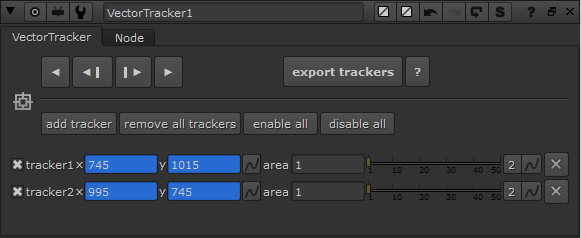

# VectorTracker NKPD

**Author:** Jorrit Schulte - [http://www.jorritschulte.com/nuke-tools/](http://www.jorritschulte.com/nuke-tools/)

This is a tracker gizmo that uses vector information rather than image data to track points. This is useful for certain tracking jobs that are otherwise hard to accomplish. Think of shots that constantly shift focus, or tracks on objects that deform.

This gizmo works with both classic nuke vectors or smartvector data.

If you use smartVectors live, make sure to add a VectorToMotion node after the smartVector and plug the vector input into this to register.

Simply render out either classic nuke vectors or smartvectors, and use this tool to generate tracker points. You can try using a VectorGenerator node to generate live vectors instead, but due to the way nuke and python sample image data this won't always work. The points are exported to a regular Tracker node.

It is looking for motion, forward, backward, backward channels, or VectorGenerator / smartVector (plus VectorToMotion) nodes for the vector input.
