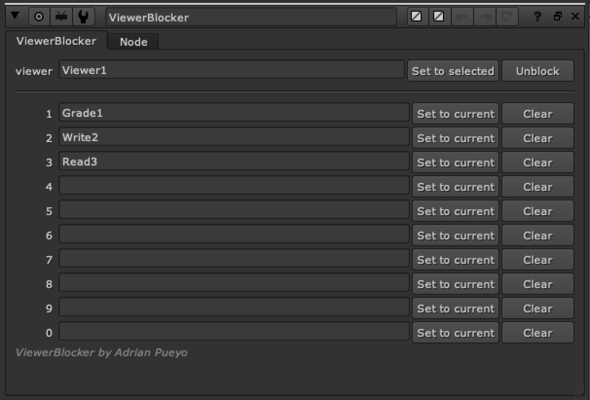

# apViewerBlocker [AP]

**Author:** Adrian Pueyo - [http://www.adrianpueyo.com/](http://www.adrianpueyo.com/)

Locks the Viewer's input to specific nodes, so you can reference the same views when you are using the numeric hotkeys without worrying about resetting or accidentally switching the viewer inputs.

Good for referencing certain images, like:
- Final image set to 9
- Reference image set to 8
- Plate set to 0
### How to Use
1. Select a viewer you wish to Block/Lock and click "set to Selected" on the viewer box
2. View an image that you wish to save/lock to a hotkey and "set to current" on one of the numbers 1,2,3,4,5,6,7,8,9,0
3. This will enter the node's name in the text input and lock that viewer input to that node
4. When you use the number hotkey it always views this node
5. Clear any fields to reset them
