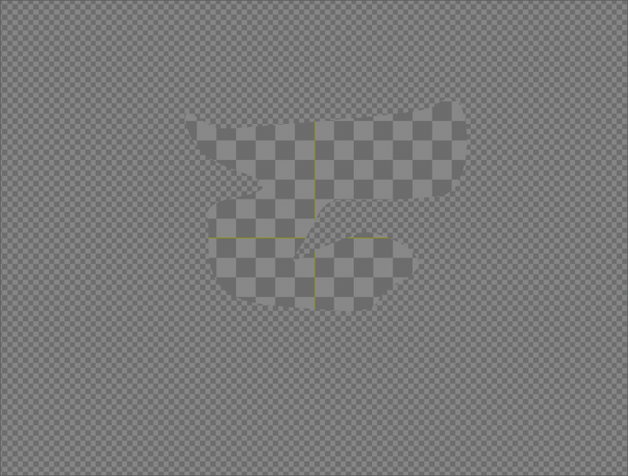
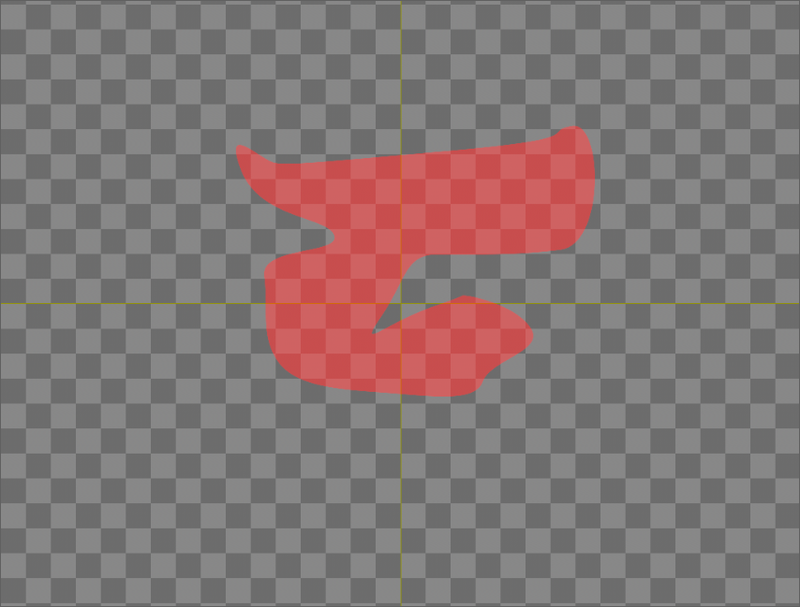
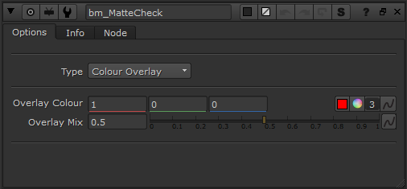

# bm_MatteCheck [BM]

**Author:** Ben McEwan - [https://benmcewan.com/nukeTools.html](https://benmcewan.com/nukeTools.html)

- [https://benmcewan.com/nukeTools.html](https://benmcewan.com/nukeTools.html)

Simple gizmo to help QC roto and keys, by overlaying a transparent colour, viewing a premultiplied image over grey or a checkerboard (for light and dark values).

