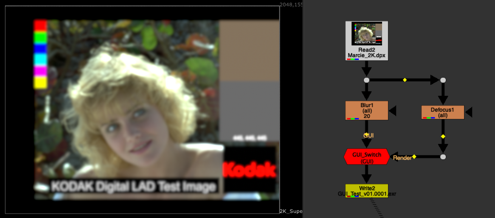
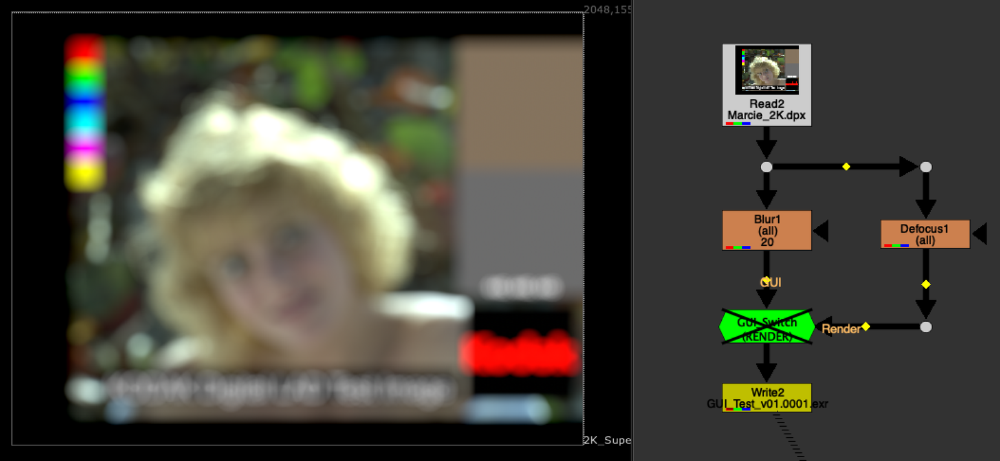

# GUI_Switch [TL]

**Author:** Tony Lyons - [http://www.CompositingMentor.com](http://www.CompositingMentor.com)

There were some issues with the $gui expression that everyone knows: when you render a frame locally instead of on a render farm, it did not register and would not switch over.

This tool uses a lesser known python expression called `nuke.executing()` which seems to solve this problem.

Inside the gizmo is just a switch node with the expression on the 'which' knob. 2 inputs: GUI and Render.
- Plug **GUI** into the node you want to view live in the Nuke script while you are working
- Plug **Render** input into whatever you want to switch to when you are rendering/executing something
Usually this is for speedy work environments and switching to higher settings/samples on render time.
### Visual Indicators
- When the node is **on**: Red and says "GUI"
- When the node is **disabled**: Green and says "RENDER"
This will let you conveniently preview the Render or GUI.
*Node has no settings, just a description. Just plug in and disable/enable!*

