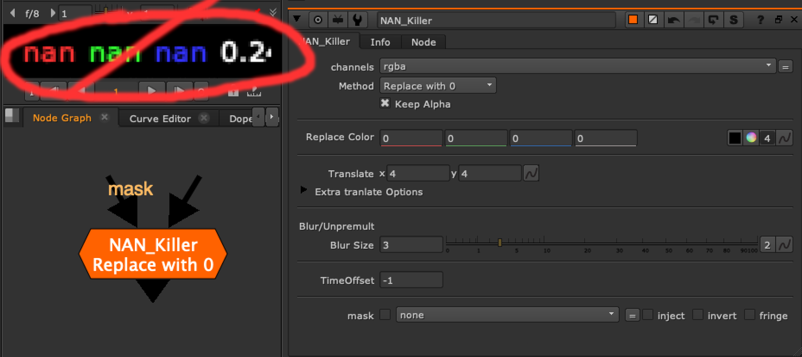

# NAN_INF_Killer [TL]

**Author:** Tony Lyons - [http://www.CompositingMentor.com](http://www.CompositingMentor.com)

Kills NaN and Inf pixels using a variety of replacement methods:
### Replacement Methods
- Replace with 0
- Replace with Custom Color
- Clone Over
- Blur/Unpremult
- Time
### Features
- **Keep alpha:** Keep the original alpha if the alpha channel does not have NaN or Inf in it. Separates RGB from Alpha in expression.
- **Exposed settings:** Replace color, transform (for Clone over), blur/unpremult, time offset
