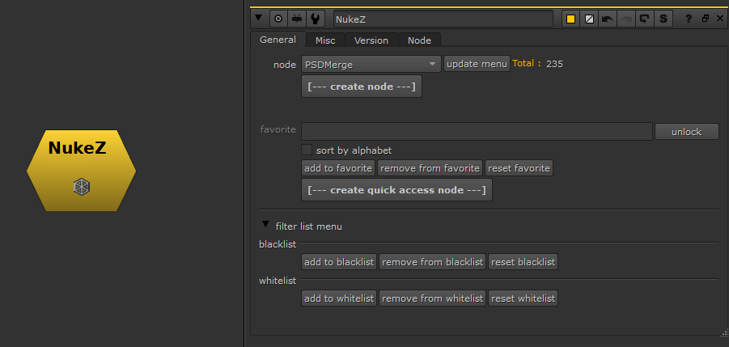
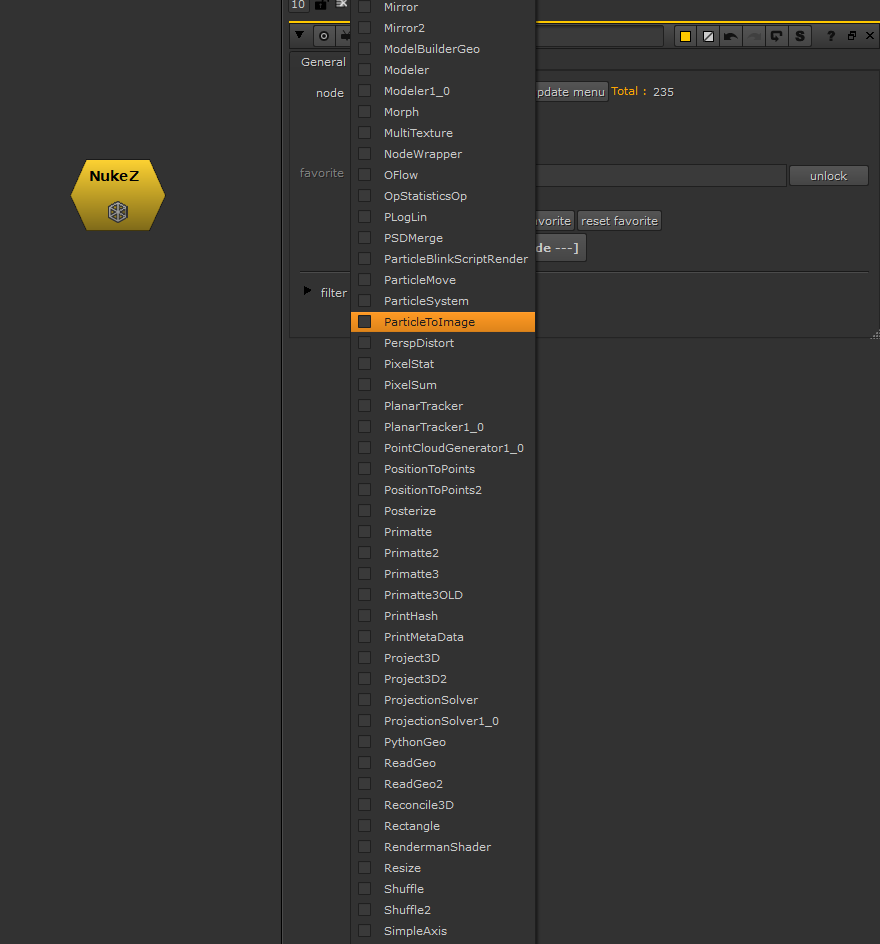

# NukeZ [MJT]

**Author:** Mark Joey Tang - [http://www.facebook.com/MJTlab](http://www.facebook.com/MJTlab)

- [http://bit.ly/menupy](http://bit.ly/menupy)

NukeZ can access hidden/old version nodes quickly without memorizing the class name. Create personal favorite node sets (including those hidden/old version nodes).
### How to Use
1. Click 'update menu' for your first run. It's because different versions of Nuke have different node sets. (e.g. ParticleBlinkscriptRender will give you error if pulled out on Nuke12.0 or below)
2. After updating the menu, select any nodes in the menu, and click 'create node' to pull it out
3. You can also 'add to favorite'. Once you are done with the favorite list, click 'create quick access node', then it will create a node with all your favorite nodes in a single panel
4. After that, you don't need NukeZ anymore, you can just save 'NukeZfav_xx' into your toolset for personal use
### How It Works
The tool detects all files in the plugin folder. There are a lot of nodes that already exist in Nuke's UI menu, so there's a filter function. The duplicated classes will not show up in this tool - only those with multiple versions and hidden ones.
### Examples
- 4 different versions of 'Tracking' (many people like to stick with the old one)
- 2 versions of LensDistortion (the old one is often preferred)
- Hidden nodes like 'ParticleToImage'
You can edit the filter manually and detect file types. Whitelist is a list that doesn't find in the folder, so type in the node class manually to make it appear in the menu.

