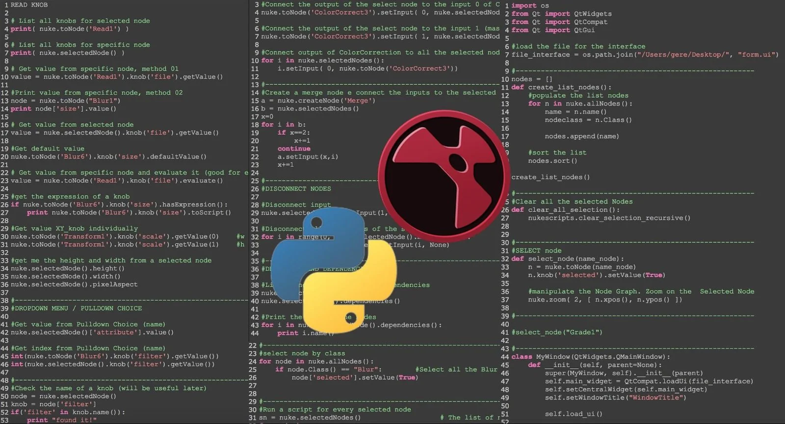
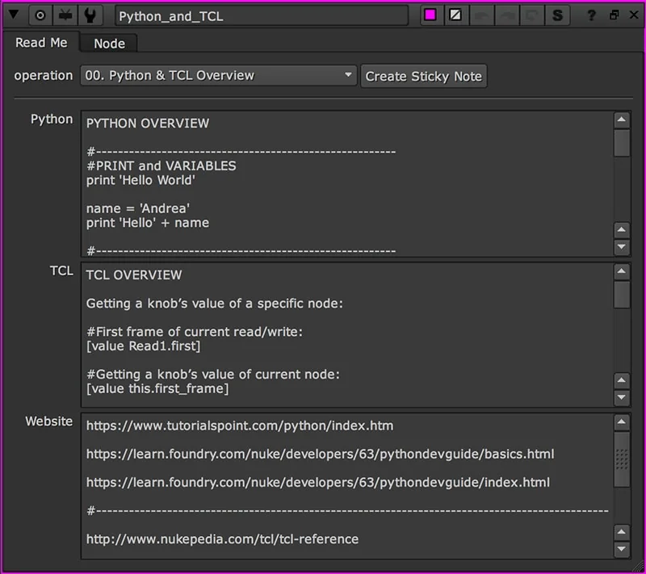
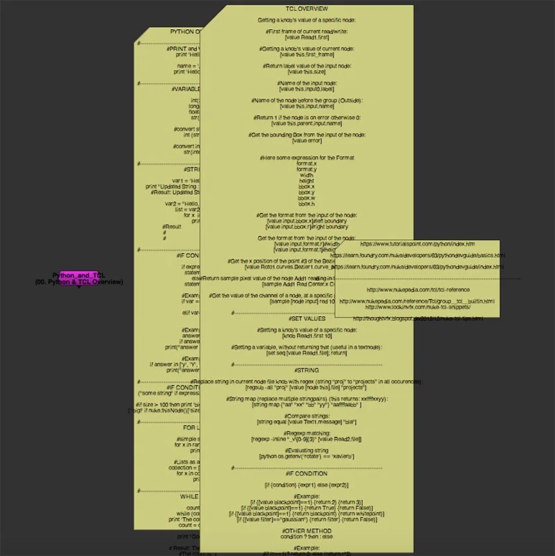

# Python_and_TCL [AG]

**Author:** Andrea Geremia - [http://www.andreageremia.it/tutorial.html](http://www.andreageremia.it/tutorial.html)

- [http://www.nukepedia.com/gizmos/other/python-and-tcl-tips-and-tricks](http://www.nukepedia.com/gizmos/other/python-and-tcl-tips-and-tricks)
- [http://www.andreageremia.it/tutorial_python_tcl.html](http://www.andreageremia.it/tutorial_python_tcl.html)

Huge collection of Python and TCL snippets to use inside Nuke.

In this Gizmo you will find tips and tricks that Andrea has written and picked up from other websites about Python and TCL.

It's a Guide by categories to read directly in Nuke, really useful for all Nuke Artists.
### Sections of the Guide
00. PYTHON AND TCL OVERVIEW
01. CREATE NODE
02. SELECT NODE
03. CONNECT NODES
04. READ FROM A KNOB
05. WRITE INTO A KNOB
06. CREATE A NEW KNOB
07. ANIMATION AND CURVE
08. EXPRESSIONS
09. MATH FUNCTIONS AND WAVE GENERATOR
10. FUNCTIONS DEF()
11. CALLBACKS
12. CUSTOM PANELS
13. TRICKS

