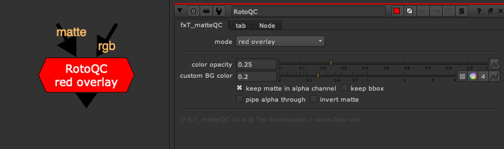

# RotoQC [NKPD]

**Author:** Tor Andreassen - [http://www.fxtor.net/nuke.html](http://www.fxtor.net/nuke.html)

- [http://www.nukepedia.com/gizmos/other/matteoverlay](http://www.nukepedia.com/gizmos/other/matteoverlay)

Tool intended to check roto matte's accuracy.

This is a QC tool for checking roto-mattes. It works with all formats (format is grabbed from the input), meaning it will work with all aspect ratios, including anamorphic plates.
### QC Options
- Overlay of red, green, or blue
- Stencil from plate
- Premult against BG (grey, checkerboard, or custom color)
It's set up so all the user needs to do is pick the QC mode from a dropdown menu, and the rest is handled by the gizmo, including alpha handling.

For color overlay, the user can control the opacity with a slider.

The node is stackable and alpha will carry through so you can have as many of these nodes you want and the alpha will still be correct.
