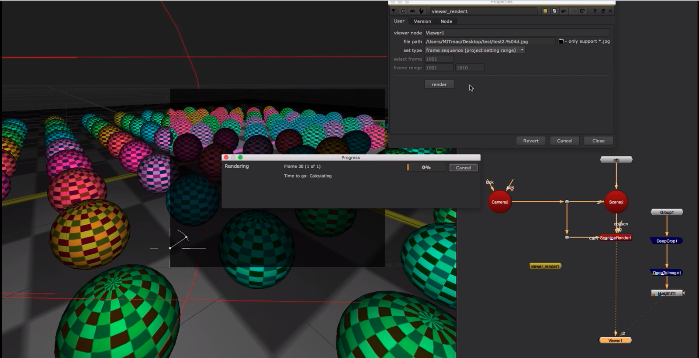

# ViewerRender [MJT]

**Author:** Mark Joey Tang - [http://www.facebook.com/MJTlab](http://www.facebook.com/MJTlab)

- [http://www.nukepedia.com/gizmos/other/viewer-render](http://www.nukepedia.com/gizmos/other/viewer-render)
- [http://bit.ly/menupy](http://bit.ly/menupy)
- Video: [https://vimeo.com/315590788](https://vimeo.com/315590788)

Viewer Render is a tool that can render anything shown in viewer, even with UI, like playblast in Maya but in Nuke. Supports 2D and 3D, anything visible in the viewer.

It's good for:
- Showing a witness camera
- Making tutorial videos
- Showing a problem visually and bringing it up for discussion
*If you run into any problems during render, please make sure the display card driver is up to date.*
### How to Use
1. Enter Viewer node name to render
2. Set render path and frame range
3. Click render

