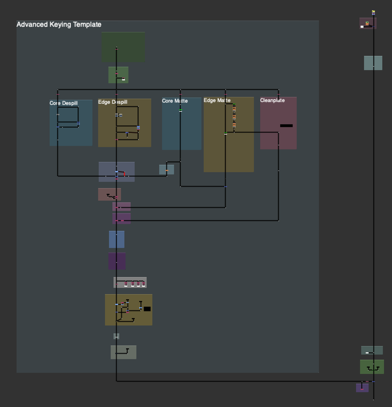

# Advanced Keying Template Stamps [TL]

**Author:** Tony Lyons - [http://www.CompositingMentor.com](http://www.CompositingMentor.com)

This is an updated Advanced Keying Template using Adrian Pueyo's Stamps. You can download his stamps plugin here: [https://www.nukepedia.com/gizmos/other/stamps](https://www.nukepedia.com/gizmos/other/stamps)
### Changes from Original
Mainly just changed the organization of the script while keeping true to the original template structure.
### Features
- **Cleanplate section** - Can be used later with the additive keying section
- **All passes piped in** before the Color Corrections and Transformations section
- **Passes piped out and converted to stamps** after the transformations section, to be used elsewhere
- **Updated cleanplate creation** - Experimental method using ibk_Colour node (feel free to use any other unpremult/blur or IBK stack, or edge extend method, or plug in your cleanplate if you have one)
- **Feature replaced by exponBlurSimple node**
- **Lightwrap section** after the premult
- **Additive keying section** near the merge
*If you don't like stamps, feel free to adjust/add dots and pipelines and configure in whichever way you like to help your workflow.*
