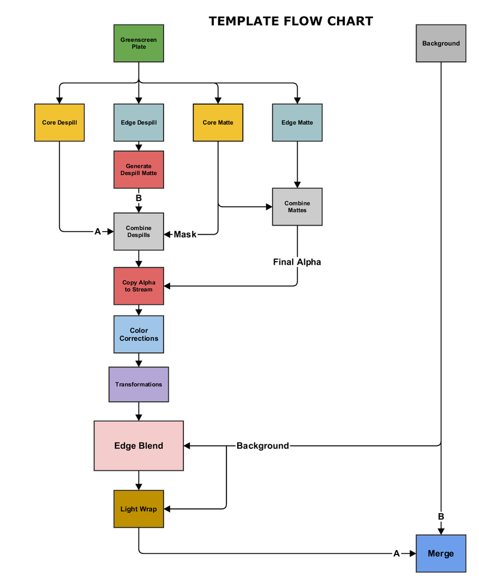

# Advanced Keying Template [TL]

**Author:** Tony Lyons - [http://www.CompositingMentor.com](http://www.CompositingMentor.com)

- [http://www.nukepedia.com/gizmos/keyer/advanced_keying_template_pack](http://www.nukepedia.com/gizmos/keyer/advanced_keying_template_pack)
- [https://compositingmentor.com/2015/12/18/advanced-keying-breakdown-4-1-template/](https://compositingmentor.com/2015/12/18/advanced-keying-breakdown-4-1-template/)
- [https://www.youtube.com/playlist?list=PLt2Nu4KGXJ2iXe7s-ydCQ9u1tTzzApmJX](https://www.youtube.com/playlist?list=PLt2Nu4KGXJ2iXe7s-ydCQ9u1tTzzApmJX)
- [https://compositingmentor.com/category/advanced-keying-breakdown/](https://compositingmentor.com/category/advanced-keying-breakdown/)
- Video: [https://youtu.be/BKcKpPFVmCk](https://youtu.be/BKcKpPFVmCk)

For in-depth detail about how to use this template and different techniques and methods to look for in each section, please visit the full Keying Tutorial Playlist and website series linked above.
### Template Structure
Broken down into 5 sections:
1. **Core Despill** - Initial despill work
2. **Edge Despill** - Edge-specific despill handling
3. **Core Key** - Main keying operations
4. **Edge Key** - Edge refinement
5. **Background Blend** - Final integration
Organized to help with complex shots with transformations and color corrections to the Greenscreen element.

