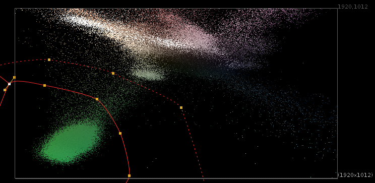

# STMap Keyer Setup [EL]

**Author:** Erwan Leroy - [http://erwanleroy.com/blog/](http://erwanleroy.com/blog/)

- [http://erwanleroy.com/make-a-custom-advanced-keyer-using-stmap/](http://erwanleroy.com/make-a-custom-advanced-keyer-using-stmap/)

The idea of this method is to represent the image as a 2D point cloud (vs 1D points or 3D points above) and use some sort of shape to define which area should be transparent or solid, as well as softness.

This is convenient because we have some great tools to define areas in 2D: Roto and Rotopaint, as well as a great tool to do 2D mapping: STMap.
### The Concept
Since we're in 2D, we can now use 2 channels as our 2 axes. Which 2 you would like to use is sort of up to you, and based on your specific footage.

For chroma keying, two channels that make sense for this approach are the **cb** and **cr** channels of the YCbCr colorspace, though Luma and Hue could work, or Hue and Saturation, etc.
### Basic Implementation
The basic implementation is rather simple:
1. Set 2 channels as the STMap input of an STMap node
2. Use a roto as the source
### Sample Footage
This template uses a plate from the Open Source project Tears of Steel, which you can download here: [https://media.xiph.org/tearsofsteel/tearsofsteel-footage-exr/02_3c/linear_hd/](https://media.xiph.org/tearsofsteel/tearsofsteel-footage-exr/02_3c/linear_hd/)
